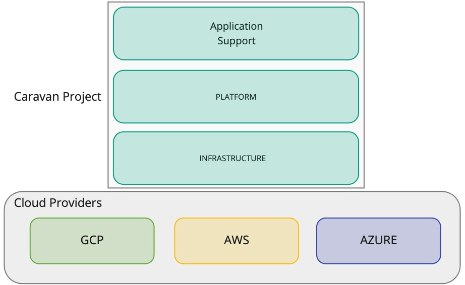
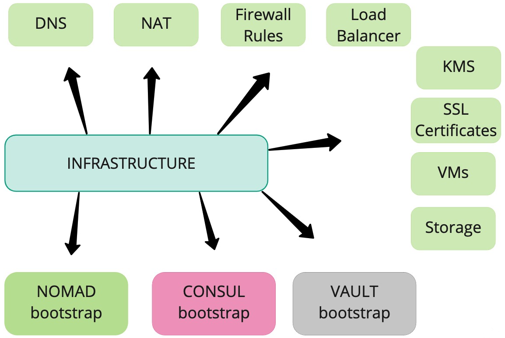
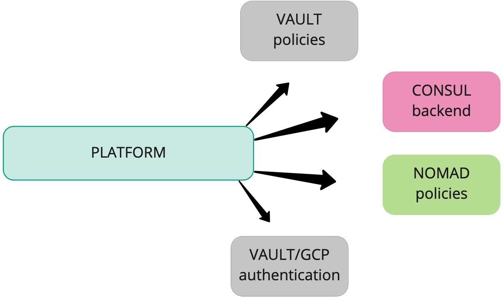
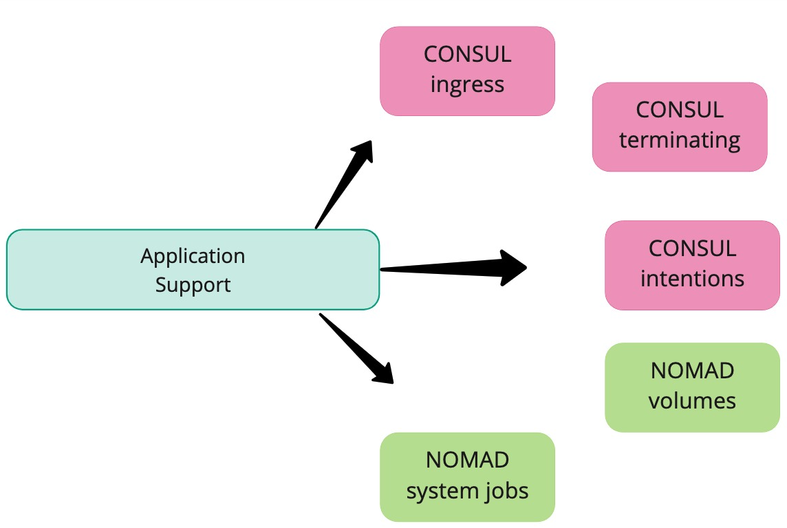

Welcome to Caravan!
###################

What is Caravan?
----------------

Caravan is your platform builder based on the HashiCorp stack. Terraform
and Packer are used to build and deploy a cloud native and ready to use platform
composed of `Vault <https://www.hashicorp.com/products/vault>`_, `Consul <https://www.hashicorp.com/products/consul>`_ and `Nomad <https://www.hashicorp.com/products/nomad>`_.

The idea behind `Caravan <https://caravanproject.io/>`_ is to provide a one-click experience to
deploy an entire infrastructure and its configuration needed to run
the full HashiCorp stack in your preferred cloud environment. 

Infrastructure and Configuration as Code are at the core of Caravan. 

Caravan's code base is modular and layered to achieve the maximum flexibility and yet 
cover the most common use cases. Multiple cloud providers and optional components 
can be mixed to achieve specific goals.

Caravan supports both OpenSource and Enterprise versions of HashiCorp products.

Currently supported platforms
-----------------------------

* Amazon Web Services (AWS)
* Google Cloud Platform (GCP)
* Microsoft Azure

High-level architectural explanation 
------------------------------------

From an architectural point of view, Caravan is formed by 3 layers.
Each layer has a scope.

Infrastructure layer
^^^^^^^^^^^^^^^^^^^^

The infrastructure layer is responsible for communicating with the cloud provider to provision all the resources the platform needs to function properly.

The resources are related to compute, to network and to storage matters.

Only in this layer there is the use of SSH connections for a lower level interaction with VMs.

Platform layer
^^^^^^^^^^^^^^

Application Support layer
^^^^^^^^^^^^^^^^^^^^^^^^^

.. toctree::
    :maxdepth: 2
    :glob:
    :hidden:

    getting-started-on-aws.rst
    getting-started-on-gcp.rst
    getting-started-on-azure.rst
    hashicorp-enterprise.rst
    deploying-applications.rst
    tf-infras/index.rst
    tf-modules/index.rst
    known-issues.rst
    changelog.rst
